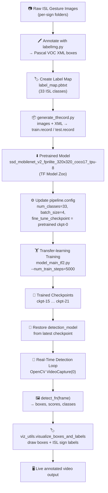
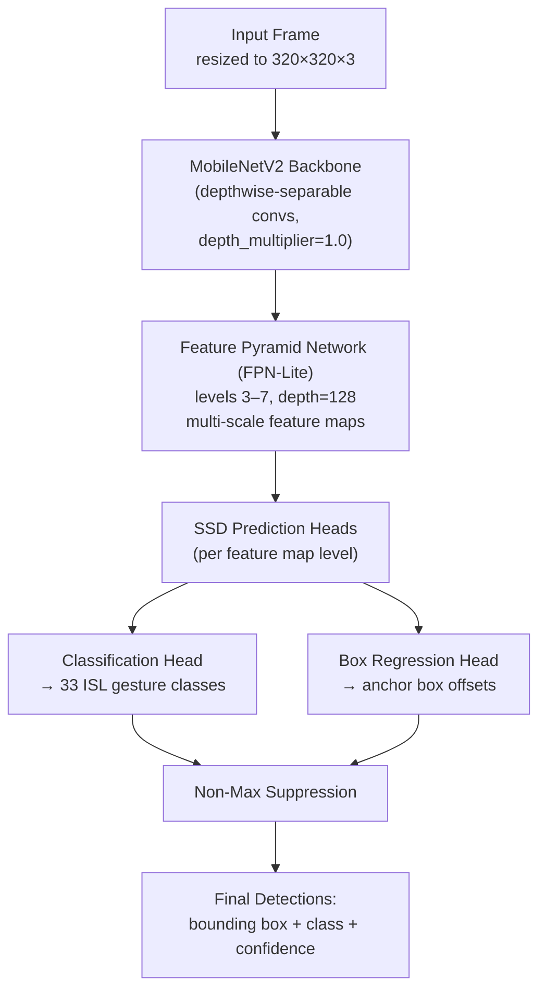

# 🎬 Real-Time Sign Language Detection

> "Bridging Spoken Language and Indian Sign Language in Real Time" ✨

A deep-learning object-detection project built on **TensorFlow 2 / TF Object Detection API** that detects and classifies **Indian Sign Language (ISL)** hand gestures in real time from a webcam feed. The project fine-tunes an **SSD MobileNetV2 FPN-Lite (320×320)** model on a custom-annotated ISL gesture dataset to enhance communication and accessibility for the hearing-impaired community. 🤝

---

## 🚀 Features

- ✋ Real-time hand-gesture detection for ISL via webcam
- 🏷️ Custom-trained detector covering **33 gesture classes**
- 🖼️ Dataset annotation workflow using `labelImg`
- 🔄 End-to-end training pipeline driven by `Tutorial.ipynb`
- 💾 Multiple ready-to-use training checkpoints (`ckpt-15` → `ckpt-21`)
- 🎥 Live bounding-box + label overlay using OpenCV

---

## 🧰 Tech Stack

| Layer | Technology |
|---|---|
| Language | Python 🐍 |
| Deep Learning | TensorFlow 2, TF Object Detection API |
| Model | SSD MobileNetV2 FPN-Lite 320×320 (COCO17 TPU-8 pretrained) |
| Annotation | `labelImg` (PyQt5-based bounding-box labeling tool) |
| Data pipeline | `generate_tfrecord.py` (images + XML labels → TFRecord) |
| Vision / IO | OpenCV, NumPy |
| Acceleration | CUDA GPU ⚡ (optional but recommended) |

---

## 🏗️ Project Architecture — Training & Inference Pipeline

The whole workflow is orchestrated step-by-step inside `Tutorial.ipynb`, following the standard TensorFlow Object Detection API transfer-learning pattern.



---

## 🧠 Model Architecture — SSD MobileNetV2 FPN-Lite (320×320)



---

## 📁 Project Structure

```
SIGN_LANGUAGE_DETECTION-main/
├── README.md
├── Tutorial.ipynb                 # End-to-end pipeline notebook (setup → train → infer)
├── generate_tfrecord.py            # Converts labeled images (XML) → TFRecord
├── labelImg.py                      # GUI tool for drawing/annotating bounding boxes
├── setup.py                          # Packaging script for labelImg
├── __init__.py
├── checkpoint                         # Pointer file → latest custom model checkpoint
├── ckpt-15.{index,data-00000-of-00001} # Custom fine-tuned checkpoints
├── ckpt-16.{index,data-00000-of-00001}
├── ckpt-17.{index,data-00000-of-00001}
├── ckpt-18.{index,data-00000-of-00001}
├── ckpt-19.{index,data-00000-of-00001}
├── ckpt-20.{index,data-00000-of-00001}
├── ckpt-21.{index,data-00000-of-00001}
└── ssd_mobilenet_v2_fpnlite_320x320_coco17_tpu-8/
    ├── pipeline.config              # Model + training configuration (33 classes)
    ├── checkpoint/                    # Original COCO-pretrained checkpoint (ckpt-0)
    └── saved_model/                    # Exported SavedModel + variables
```

---

## ⚙️ Setup

```bash
git clone <repo-url>
cd SIGN_LANGUAGE_DETECTION-main

# Create environment
python3 -m venv venv
source venv/bin/activate

# Core dependencies
pip install tensorflow opencv-python numpy pandas matplotlib

# TF Object Detection API
git clone https://github.com/tensorflow/models Tensorflow/models
# follow: https://tensorflow-object-detection-api-tutorial.readthedocs.io/en/latest/install.html
```

---

## 🏋️ Training Workflow (as implemented in `Tutorial.ipynb`)

1. **Setup paths** — define workspace, annotations, images, models & pretrained-model directories
2. **Create label map** — `label_map.pbtxt` mapping each ISL sign to a class id
3. **Generate TFRecords** — `generate_tfrecord.py` converts annotated train/test images into `train.record` / `test.record`
4. **Download pretrained model** — `ssd_mobilenet_v2_fpnlite_320x320_coco17_tpu-8` from the TF2 Model Zoo
5. **Configure for transfer learning** — edit `pipeline.config`: `num_classes=33`, `batch_size=4`, point `fine_tune_checkpoint` to the pretrained `ckpt-0`
6. **Train** —
   ```bash
   python Tensorflow/models/research/object_detection/model_main_tf2.py \
       --model_dir=Tensorflow/workspace/models/my_ssd_mobnet \
       --pipeline_config_path=Tensorflow/workspace/models/my_ssd_mobnet/pipeline.config \
       --num_train_steps=5000
   ```
7. **Load trained model** — restore from the latest checkpoint (`ckpt-15` … `ckpt-21` included in this repo)
8. **Run real-time detection** — capture webcam frames, run `detect_fn()`, and draw bounding boxes + ISL labels with `viz_utils`

---

## 🎯 Usage

- Run the real-time detection cell in `Tutorial.ipynb` (or a packaged `app.py`) with a webcam connected
- Point your hand/sign at the camera — detected ISL gestures are boxed and labeled live
- Press `q` to stop the video capture loop

---

## 📈 Future Work

- Expand vocabulary coverage for ISL gestures (beyond the current 33 classes)
- Add continuous sentence-level sign recognition (sequence models / LSTM over detections)
- Package as a Streamlit/Flask web app for easier deployment
- Deploy on mobile devices (TFLite) for wider accessibility

---

## 👩‍💻 Contributors

- **Pooja Mahesh** – Project Lead & AI Model Developer
